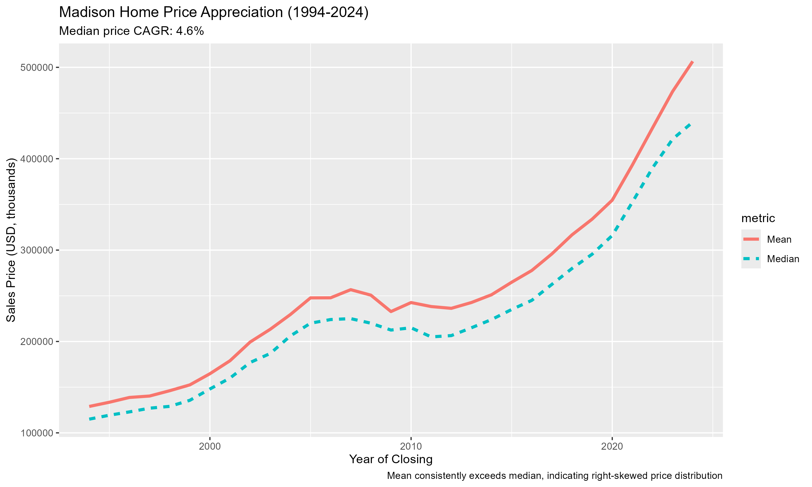

Over three decades, Madison’s single-family home market has climbed from roughly **$100,000 (1994)** to **$400,000+ (2024)** at the median—a compounded growth rate near **4.6%**. My new report analyzes **68,000+** recorded sales to show how prices, home sizes, and market intensity evolved.

### Highlights
- **Steady Appreciation:** Median prices rose fourfold since 1994; the **mean > median** throughout, reflecting right-skewed distributions.
- **Price Intensity:** **Price per square foot** more than tripled, accelerating after 2010—consistent with supply constraints.
- **Market Volume:** Annual sales fluctuated (~1850 to > 2,700). Recent softening (2022–2024) aligns with affordability pressure and rates.
- **Size Inflation:** Median finished square feet increased by ~**400 sq ft** over 30 years.
- **Stable Composition:** **3-bedroom homes** consistently make up ~45–50% of transactions.

### Madison Home Price Appreciation (1994–2024)

The chart shows median vs. mean prices by year. Despite the volume slowdown post-2021, prices remain elevated relative to long-run trends.

---

📄 **Full PDF report:** [proj1_mad_city_hist.pdf](proj1_mad_city_hist.pdf)

